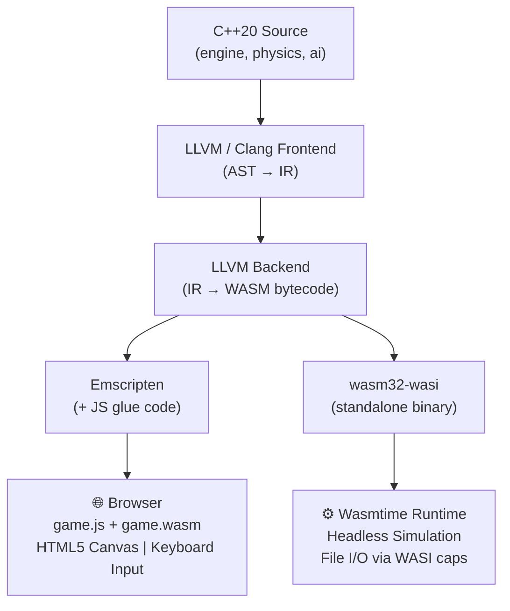

# Space Defender 🚀
### A Cross-Platform Game — C++ → WebAssembly (Browser) + WASI (Server/Edge)

> **Educational Project**: Demonstrates how a single C++20 codebase compiles to two completely different WebAssembly targets — a fully playable browser game and a headless server-side simulation.

---

## ⚡ Quick Start (Already Built)

The game is pre-compiled. To play it immediately:

```bash
# Step 1: Go to the build output directory
cd build/browser

# Step 2: Serve it with a local web server
python3 -m http.server 8081

# Step 3: Open your browser at:
#   http://localhost:8081
```

### Controls
| Key | Action |
|---|---|
| `← → ↑ ↓` or `W A S D` | Move spaceship |
| `Space` | Fire bullets |
| `R` | Restart game |

> If the `build/browser/` folder does not exist, run `./build_browser.sh` first (requires Emscripten).

---

## 🎯 Project Objective

Space Defender proves a key WebAssembly concept: **write once, compile everywhere**.

The same `engine/`, `ai/`, and `include/` C++ code is compiled into:

| Target | Tool | Output | Runs in |
|---|---|---|---|
| **Browser** | Emscripten (`emcc`) | `game.js` + `game.wasm` | Chrome / Firefox |
| **WASI** | `clang++ --target=wasm32-wasi` | `wasi_defender.wasm` | Wasmtime, Wasmer |
| **Native** | `g++` | `test_engine` binary | Linux / macOS |

The platform-specific code (rendering, input, file I/O) is isolated to thin adapter layers (`browser/main_browser.cpp` and `wasi/main_wasi.cpp`). The core game logic never changes.

---

## 🏗️ What Each Component Does

### `include/` — Shared Headers
The blueprint for the entire game. No platform-specific code.
- **`engine.h`** — Defines `GameEngine`: the main class holding all game state (player, enemies, bullets, power-ups), the fixed-timestep update loop, and render callbacks.
- **`physics.h`** — Defines `Vec2` (2D vector math), `AABB` (bounding box collision), and `clampf` utility.
- **`ai.h`** — Defines the `EnemyAI` Finite State Machine with 4 states: `PATROL → CHASE → ATTACK → RETREAT`.
- **`score.h`** — Defines `ScoreManager` (combo multiplier, high score) and `ObjectPool<T>` (pre-allocated memory pools).

### `engine/engine.cpp` — Game Logic
The heart of the game. Handles every frame:
1. Player movement based on input flags
2. Bullet movement and lifetime
3. Enemy spawning, sine-wave descent, and shooting
4. Boss spawning and multi-phase spread shot
5. Collision detection (player bullets vs enemies, enemy bullets vs player, power-up collection)
6. Level advancement when enough enemies are killed

### `ai/ai.cpp` — Enemy AI
A Finite State Machine that decides enemy behavior each frame:
- **PATROL**: Moves in a sine-wave pattern while descending toward the player.
- **CHASE**: Rushes directly toward the player when within 250px.
- **ATTACK**: Hovers and fires repeatedly when within 120px.
- **RETREAT** *(Boss only)*: Moves away when HP drops below 33%, then transitions back to ATTACK.

### `browser/main_browser.cpp` — Browser Adapter
The thin Emscripten layer connecting the C++ engine to the browser:
- `emscripten_set_main_loop()` — syncs the game loop to `requestAnimationFrame` (60fps)
- `EM_JS` macros — defines `js_drawRect()` and `js_clearCanvas()` which call real HTML5 Canvas 2D API
- `emscripten_set_keydown/keyup_callback` — captures keyboard input
- `EMSCRIPTEN_KEEPALIVE` — marks functions like `getScore()`, `resetGame()` as JS-callable exports

### `browser/index.html` — Game UI
The dark-space themed frontend with:
- A live HUD showing Score, Health (❤), and Level
- The HTML5 Canvas where the game renders
- A **JS ↔ WASM Interop Demo Panel** — click buttons to call C++ functions live from JavaScript

### `wasi/main_wasi.cpp` — WASI Adapter
Runs the same game engine headlessly (no graphics). Used for:
- Automated AI simulation (`--frames N`)
- Saving scores to files on the host filesystem (requires `--dir` capability grant from Wasmtime)
- Demonstrating the WASI security model (default deny, explicit capability grants)

### `tests/test_engine.cpp` — Unit Tests
27 unit tests covering:
- Vec2 math and AABB collision
- ScoreManager combo/multiplier logic
- EnemyAI state transitions
- Full GameEngine lifecycle (init, update, reset)

---

## Architecture Overview



---

## Directory Structure

```
space_defender/
├── include/          # Shared headers (engine, physics, ai, score)
├── engine/           # GameEngine — fixed timestep loop, ECS-lite
├── physics/          # Vec2, AABB, PhysicsBody
├── ai/               # Enemy AI finite state machine
├── browser/          # Emscripten entry + HTML/CSS shell
├── wasi/             # WASI headless simulation entry
├── tests/            # Native unit tests (g++)
├── build/            # Build outputs (gitignored)
├── CMakeLists.txt    # Three-profile build system
├── build_browser.sh  # Browser build script
├── build_wasi.sh     # WASI build script
└── README.md
```

---

## Class Diagram

```
┌─────────────────┐      ┌──────────────────┐
│  GameEngine     │      │  EnemyAI (FSM)   │
├─────────────────┤      ├──────────────────┤
│ update(dt)      │      │ PATROL           │
│ render()        │      │ CHASE            │
│ init() / reset()│      │ ATTACK           │
│ inputLeft/Right │      │ RETREAT          │
│ getScore()      │      │ tick(AIContext)  │
│ getHealth()     │      └──────────────────┘
│ getLevel()      │
└────────┬────────┘
         │ owns
   ┌─────┼─────────────┐
   ▼     ▼             ▼
Player  Enemy[]     Bullet[]    PowerUp[]
(Vec2) (hp,isBoss) (vy,isEnemy) (type)
```

---

## How WASM is Generated

### Step 1: C++ → LLVM IR
```
g++ -emit-llvm -S engine.cpp  →  engine.ll  (LLVM Intermediate Representation)
```

### Step 2: LLVM IR → WASM
Emscripten uses LLVM's wasm32 backend:
```
emcc engine.cpp browser/main_browser.cpp → game.js + game.wasm
```

### Step 3: Browser Loads WASM
```javascript
// game.js (auto-generated by Emscripten)
WebAssembly.instantiateStreaming(fetch('game.wasm'), importObject)
  .then(({ instance }) => {
      // instance.exports._getScore()  ← C++ function, callable from JS
  });
```

---

## WebAssembly Memory Model

```
WASM Linear Memory (ArrayBuffer)
┌────────────────────────────────────────────────┐
│ Stack │ Static Data │ Heap (malloc/free)        │
│       │ (globals)   │  ← bullets_, enemies_     │
└────────────────────────────────────────────────┘
  ↑
  Managed by Emscripten runtime (ALLOW_MEMORY_GROWTH=1)
  JS accesses via: Module.HEAP32, Module.HEAPF32
```

- WASM cannot access **any** memory outside this buffer.
- JS passes data to WASM by writing into `Module.HEAPF32` at specific pointers.
- WASM functions return scalar values (i32, f32) directly.

---

## Browser Sandbox vs WASI Capabilities

| Feature | Browser (WASM) | WASI (Wasmtime) |
|---|---|---|
| Filesystem | ❌ Sandboxed (virtual FS only) | ✅ With `--dir` flag |
| Env Variables | ❌ None | ✅ With `--env` flag |
| Network | ❌ Only via JS bridge | ✅ With `--tcplisten` |
| Spawn Processes | ❌ Blocked | ❌ Blocked |
| GPU / Canvas | ✅ Via JS/WebGL bridge | ❌ None |
| Clock / Time | ✅ Via JS bridge | ✅ WASI clock_time_get |

---

## Build & Run

### Prerequisites
```bash
# Browser target
source ~/emsdk/emsdk_env.sh   # Emscripten

# WASI target
# Install wasi-sdk: https://github.com/WebAssembly/wasi-sdk
# Install wasmtime: curl https://wasmtime.dev/install.sh -sSf | bash
```

### Build Browser Version
```bash
chmod +x build_browser.sh
./build_browser.sh
# Then open: http://localhost:8080
```

### Build WASI Version
```bash
chmod +x build_wasi.sh
./build_wasi.sh
```

### Run Native Tests
```bash
g++ -std=c++20 -I include tests/test_engine.cpp engine/engine.cpp ai/ai.cpp -o test_engine
./test_engine
```

### Run WASI with Custom Options
```bash
wasmtime \
  --env PILOT=YourName \
  --dir ./build/wasi/data::data \
  ./build/wasi/wasi_defender.wasm \
  -- --frames 600 --output data/scores.txt --seed 99 --verbose
```

---

## Gameplay

| Element | Description |
|---|---|
| **Player** | Blue ship, moves with WASD/arrows, fires with SPACE |
| **Enemies** | Purple ships, sine-wave descent, shoot at player |
| **Boss** | Red large ship, appears after 8×level kills, spread shot, 3-phase AI |
| **Power-ups** | Green=health, Orange=speed boost, Cyan=rapid fire |
| **Scoring** | 100pts/enemy × level, 500pts/boss × level, combo multiplier up to 8x |
| **Levels** | 5 levels, each level increases enemy speed, count, and fire rate |

---

## JS ↔ WASM Interoperability

The HTML page includes a live demo panel showing JS calling into WASM:

```javascript
// JS calls C++ function exported with EMSCRIPTEN_KEEPALIVE
const score  = Module._getScore();   // → int from C++
const health = Module._getHealth();  // → int from C++
const level  = Module._getLevel();   // → int from C++

// WASM calls JS Canvas drawing via EM_JS macros (defined in C++ source)
// js_drawRect(x, y, w, h, colorPtr) → canvas.fillRect(...)
```

---

## Performance Measurements

Run after building to collect timing data:

```bash
# WASI simulation benchmark
time wasmtime ./build/wasi/wasi_defender.wasm -- --frames 3600 --seed 1

# Browser: open DevTools → Performance tab → record 10 seconds of gameplay
# Expected: ~60fps, <2ms per frame for engine update
```

| Metric | Expected |
|---|---|
| WASM cold start (browser) | < 50ms |
| WASI cold start (wasmtime) | < 5ms |
| Engine update per frame | < 1ms |
| Binary size (game.wasm) | ~150–300KB |
